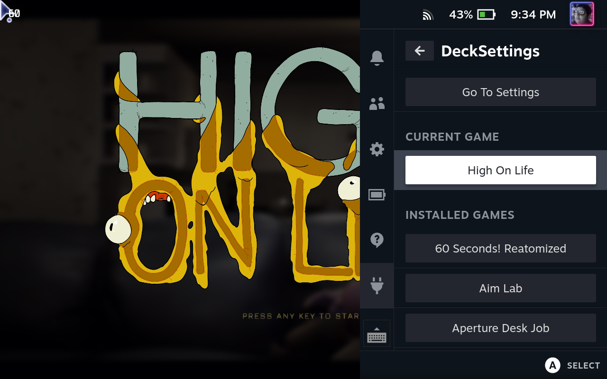
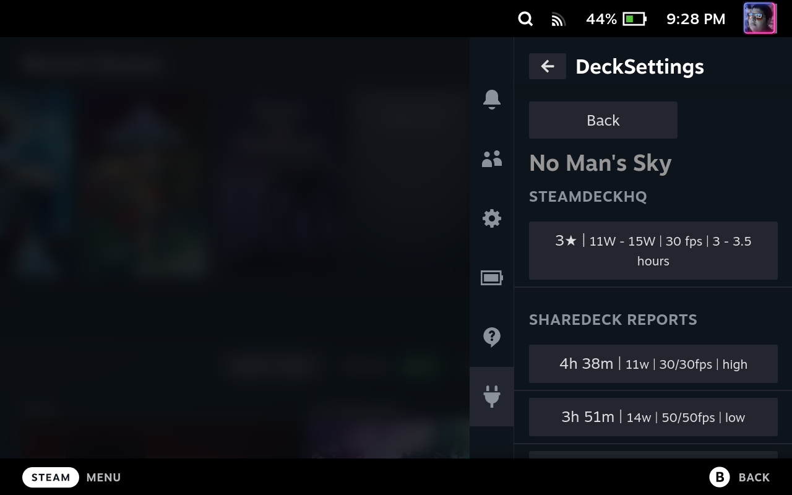
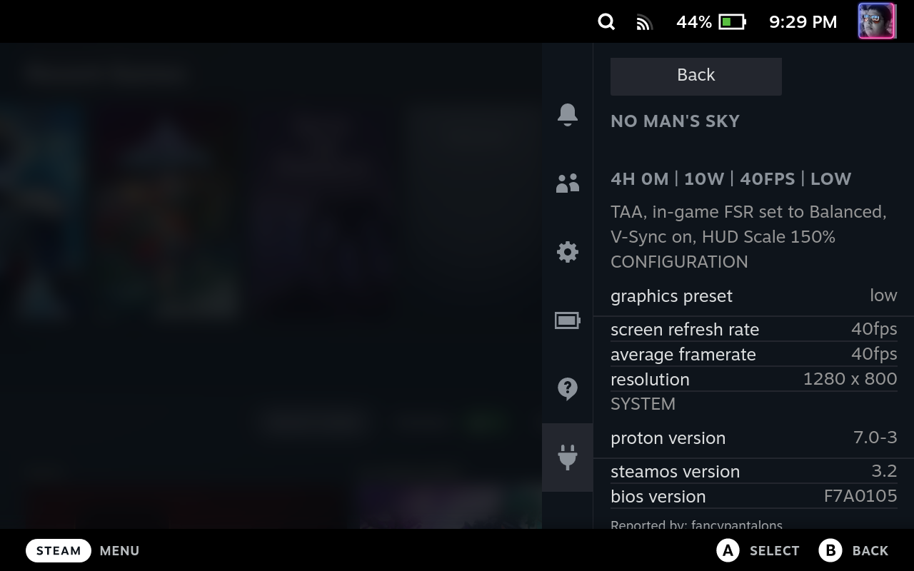
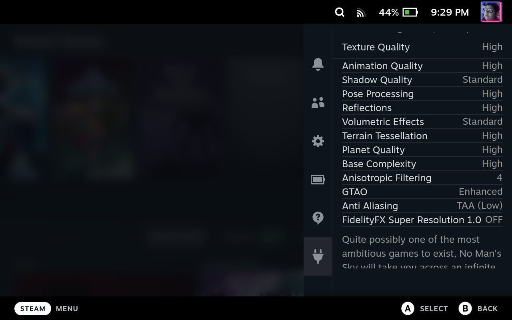

# DeckTuner

A Decky (Steam Deck Quick Access Menu) plugin that:

- browses ShareDeck + SteamDeckHQ reports (original functionality)
- adds **3 curated, switchable presets per game**:
  - **Battery Saver**
  - **Framerate**
  - **Graphics**
- can **apply** a preset (SteamOS apply is best-effort; in-game config edits are optional/experimental)
- supports **Record Mode** to discover which in-game config files change when you adjust game settings

This repo started as a fork of @davocarli’s [`sharedeck-y`](https://github.com/davocarli/sharedeck-y).

## Screenshots (legacy)

Games List             |  Reports List
:-------------------------:|:-------------------------:
  |  

ShareDeck             |  SteamDeckHQ
:-------------------------:|:-------------------------:
  |  

## Curated presets via GitHub Pages

DeckTuner fetches curated presets from:

- `<presetCdnBaseUrl>/presets/<appid>.json`

This repo includes a GitHub Actions workflow that publishes those JSON files to GitHub Pages:

- Workflow: `.github/workflows/publish-presets.yml`
- Input source: `curation/presets.source.json`
- Generator: `scripts/generate-presets.mjs`
- Output (served by Pages): `presets/index.json` and `presets/<appid>.json`

### Enable it

1. In GitHub: **Settings → Pages**
2. Set **Source** to **GitHub Actions**
3. Run the workflow **“Publish curated presets (GitHub Pages)”** (or push to `main`)

### Configure the plugin

In DeckTuner → Settings, set:

- **Preset CDN Base URL** to your Pages site base, for example:
  - `https://<your_github_user>.github.io/<your_repo>`

## Build & deploy on Steam Deck

### Prereqs

- Decky Loader installed
- Steam Deck in Desktop Mode
- Node 18+ (this repo targets Node 18+; newer versions may show engine warnings)
- npm or pnpm

### Option A (recommended): build directly on the Deck

```bash
cd ~/homebrew/plugins
git clone <YOUR_REPO_URL> DeckTuner
cd DeckTuner
npm install
npm run build
```

Then restart Decky Loader (or reboot) and open Gaming Mode → Quick Access Menu → Decky → **DeckTuner**.

### Option B: build on your PC, copy to the Deck (SSH)

```bash
npm install
npm run build
scp -r . deck@<STEAM_DECK_IP>:~/homebrew/plugins/DeckTuner
```

## Using presets

### Configure preset source (v1)

In the plugin **Settings** page:

- **Preset CDN Base URL**: where curated preset docs are hosted, expected layout:
  - `presets/<appid>.json`

Schema reference: `docs/presets-schema.md`.

### Local overrides

On a game page:

- **Save as Local Override** pins the current preset for that game + category.
- **Reset Override** reverts to the curated preset (if available).

## Graphics Writer (Experimental)

Enable **Graphics Writer (Experimental)** in Settings to use:

- **Record Mode** (Start / Stop & Analyze)
- “Attach top match to this preset” (creates a local override with a generated graphics target)

Record Mode reference: `docs/record-mode.md`.

## Curation tooling (v1)

This repo includes multiple ways to create preset files:

### Manual source + GitHub Pages (recommended)

- Edit `curation/presets.source.json`
- Run `npm run presets:build` locally (or let GitHub Actions publish)

### Legacy Python curator (optional)

A minimal curator that turns ShareDeck reports into 3 representative presets:

```bash
python tools/curate_presets.py --appid 620 --out presets/620.json
```

You can host generated `presets/<appid>.json` files on GitHub Pages (or any static host).

## V2 service (optional)

If you set **DeckTuner Service Base URL** in Settings, the UI exposes:

- “Login to DeckTuner service (Steam)” → opens `/auth/steam`
- “Upload preset to DeckTuner service” → POSTs to `/api/presets`

Reference design: `docs/v2-service.md`.

## Developer notes

- Frontend entry: `src/index.tsx`
- Backend: `main.py`
- Build: `npm run build` → produces `dist/index.js`
